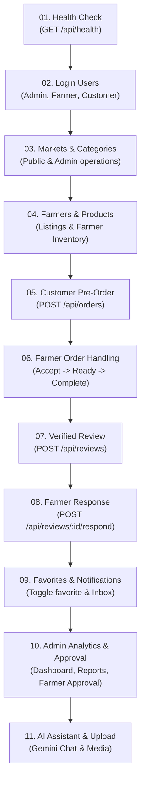

# 🚀 MarketLink Backend — Postman Testing & Demonstration Guide

This guide is designed for you and your instructor/evaluator to seamlessly test and demonstrate the complete **MarketLink MERN Backend API** using Postman.

---

## 📌 Project Overview & Configuration

| Configuration | Value | Source / Reference |
| :--- | :--- | :--- |
| **Backend Runtime** | Node.js (ES Modules, `"type": "module"`) | `package.json` |
| **Framework** | Express.js 4.21.2 | `src/app.js` |
| **Database** | MongoDB / Mongoose 8.9.5 | `src/config/db.js` |
| **Default Port** | `5000` | `src/server.js` (`process.env.PORT || 5000`) |
| **Base URL** | `http://localhost:5000` | Postman Variable `{{baseUrl}}` |
| **Auth System** | JSON Web Tokens (JWT) in `Authorization: Bearer <token>` | `src/middleware/auth.js` |
| **Total Endpoints** | 55 API Endpoints (59 Postman Requests) | 14 Feature Folders |

---

## 🛠️ Step 1: Backend Setup & Prerequisites

### 1.1 Prerequisites
1. **Node.js**: v18+ or v20+ recommended (Node v24 is also supported).
2. **MongoDB**: Ensure MongoDB local instance is running on `mongodb://localhost:27017` or use a MongoDB Atlas URI.

### 1.2 Environment Variables (`server/.env`)
Your backend requires an active `.env` file located inside `server/.env`.

```env
PORT=5000
NODE_ENV=development
MONGO_URI=mongodb://localhost:27017/marketlink
JWT_SECRET=change_this_to_a_long_random_string_please_make_it_long
JWT_EXPIRES_IN=7d
CLIENT_URL=http://localhost:5173

# Optional (for email order updates & notifications)
SMTP_HOST=smtp.gmail.com
SMTP_PORT=587
SMTP_USER=
SMTP_PASS=
EMAIL_FROM=MarketLink <noreply@marketlink.com>

# Optional (for image upload)
CLOUDINARY_CLOUD_NAME=
CLOUDINARY_API_KEY=
CLOUDINARY_API_SECRET=

# Optional (for AI Assistant chatbot - falls back gracefully to offline mode if empty)
GEMINI_API_KEY=
```

> **Mandatory Variables**: As defined in `src/config/env.js`, `MONGO_URI` and `JWT_SECRET` are strictly required; the server will exit if either is missing.

---

## 🏃 Step 2: Start the Backend & Seed Database

Open your terminal in the `server` directory:

```bash
cd MarketLink-App-main/server

# 1. Install dependencies (if not already done)
npm install

# 2. Seed the database with initial users, market, farmer, categories, and products
npm run seed

# 3. Start the development server
npm run dev
# Or standard start:
npm start
```

When started, you will see:
```
✓ MongoDB Connected: localhost
✓ Server running on http://localhost:5000
  Env: development
```

### Pre-Seeded Test Credentials
The `npm run seed` command automatically populates the database with:

| Role | Email | Password | Permissions & Scope |
| :--- | :--- | :--- | :--- |
| **Admin** | `admin@marketlink.com` | `admin123` | Platform analytics, approve/suspend farmers, manage categories, moderate products & reviews |
| **Farmer** | `bilal@marketlink.com` | `farmer123` | Stall: *"Fresh Farms"*, Empress Market, manages inventory, accepts orders, responds to reviews |
| **Customer** | `ali@marketlink.com` | `customer123` | Places orders, modifies/cancels orders, favorites farmers, writes reviews |

---

## 📥 Step 3: Import Collection into Postman

1. Open **Postman**.
2. Click the **Import** button in the top-left corner.
3. Select **File** and choose:
   `MarketLink_Postman_Collection.json`
4. The collection **MarketLink API Collection** will appear in your sidebar with 14 organized folders.

---

## 🔑 Step 4: Automated Token & Variable Handling

You **do not** need to manually copy and paste tokens or IDs between requests!

1. **Automated Tokens**:
   * Running `Login - Admin` automatically saves the token to `{{adminToken}}` and `{{authToken}}`.
   * Running `Login - Farmer` automatically saves the token to `{{farmerToken}}` and `{{authToken}}`.
   * Running `Login - Customer` automatically saves the token to `{{customerToken}}` and `{{authToken}}`.
   * Protected requests are already pre-wired to use their respective role tokens (e.g. Admin routes use `{{adminToken}}`, Farmer routes use `{{farmerToken}}`, Customer routes use `{{customerToken}}`).
2. **Automated IDs**:
   * Running `Get All Markets` automatically captures `{{marketId}}`.
   * Running `Get All Farmers` automatically captures `{{farmerId}}`.
   * Running `Get All Products` automatically captures `{{productId}}`.
   * Running `Place Order` automatically captures `{{orderId}}`.
   * Running `List Categories` automatically captures `{{categoryId}}`.
   * Running `Get My Notifications` automatically captures `{{notificationId}}`.

---

## 📋 Step 5: Recommended Testing & Demonstration Order

Follow this exact flow for a complete, error-free demonstration to your teacher:



### Detailed Execution Steps

#### Phase 1: Health & Authentication
1. **01. System & Health → Health Check**: Verifies the server is online (`200 OK`).
2. **02. Authentication → 3. Login - Admin**: Automatically sets `{{adminToken}}`.
3. **02. Authentication → 4. Login - Farmer**: Automatically sets `{{farmerToken}}`.
4. **02. Authentication → 5. Login - Customer**: Automatically sets `{{customerToken}}`.
5. **02. Authentication → 6. Get Current User (/me)**: Shows customer profile.
6. **02. Authentication → 1. Register - Customer**: Demonstrates new customer registration.
7. **02. Authentication → 2. Register - Farmer**: Demonstrates new farmer registration with stall details (status starts as `isApproved: false`).

#### Phase 2: Platform Discovery (Markets & Categories)
8. **04. Markets → 1. Get All Markets**: Shows Empress Market, sets `{{marketId}}`.
9. **04. Markets → 2. Get Nearby Markets (GeoNear)**: Tests geospatial `$near` query with coordinates.
10. **05. Categories (Admin) → 1. List Categories**: Shows default categories (Vegetables, Fruits, Dairy, Bakery).
11. **05. Categories (Admin) → 2. Create Category**: Admin creates *"Honey & Preserves"*.

#### Phase 3: Farmer Catalog & Inventory
12. **06. Farmers → 1. Get All Farmers**: Lists approved farmers, sets `{{farmerId}}`.
13. **06. Farmers → 3. Get Farmer's Products**: Shows available products for stall *"Fresh Farms"*.
14. **07. Products → 1. Get All Products (Filter & Search)**: Tests multi-criteria filtering, sets `{{productId}}`.
15. **07. Products → 3. Create Product (Farmer Only)**: Farmer Bilal adds *"Fresh Red Strawberries"*.
16. **07. Products → 5. Toggle Product Availability**: Farmer updates availability flag.

#### Phase 4: Customer Order Flow & Lifecycle
17. **08. Orders → 1. Place Order (Customer Only)**:
    * The request includes a built-in pre-request script that dynamically calculates the **next Saturday pickup date**, satisfying the farmer's schedule and 12-hour advance cutoff rule.
    * Sets `{{orderId}}`.
18. **08. Orders → 2. Get Customer Orders (My Orders)**: Customer Ali sees the newly placed order.
19. **08. Orders → 4. Get Farmer Incoming Orders**: Farmer Bilal sees the incoming pre-order.
20. **08. Orders → 6. Update Order Status - Accepted**: Farmer accepts the order.
21. **08. Orders → 7. Update Order Status - Ready for Pickup**: Farmer marks packed & ready.
22. **08. Orders → 8. Update Order Status - Completed**: Farmer completes the handover upon pickup.
    * *(Note: Order completion is required to test Reviews in Phase 5!)*

#### Phase 5: Verified Reviews & Engagement
23. **09. Reviews → 1. Create Review (Customer Only)**: Customer Ali rates the completed order 5 stars.
24. **09. Reviews → 2. Get Reviews by Farmer ID**: Shows the new review on Bilal's stall.
25. **09. Reviews → 4. Farmer Respond to Review**: Farmer Bilal thanks the customer.
26. **10. Favorites → 2. Toggle Favorite Farmer**: Customer Ali bookmarks Bilal's stall.
27. **10. Favorites → 1. Get My Favorite Farmers**: Lists bookmarked stalls.
28. **11. Notifications → 1. Get My Notifications**: Lists in-app notifications generated by the order updates.

#### Phase 6: Admin Management & Approvals
29. **12. Admin Management → 1. Admin Dashboard Stats**: Displays live counts of farmers, customers, markets, and orders.
30. **12. Admin Management → 2. Admin Reports & Revenue**: Shows total sales revenue and top-earning farmers.
31. **12. Admin Management → 3. Get Pending Farmers List**: Displays the farmer registered in Step 7 (`pendingFarmerUserId`).
32. **12. Admin Management → 4. Approve Farmer Account**: Admin approves the pending farmer so they can now log in.

#### Phase 7: AI Chat & Image Upload
33. **13. AI Assistant → Chat with MarketLink AI**: Tests AI query. Works online with Gemini API or offline with built-in fallback.
34. **14. Media Upload → Upload Image (Cloudinary)**: Tests multipart file upload (requires Cloudinary keys in `.env`).

---

## ⚠️ Potential Issues & How to Resolve Them

| Issue | Cause | Solution |
| :--- | :--- | :--- |
| **`Missing env var: MONGO_URI`** | `.env` missing or not read | Ensure `server/.env` exists and contains valid `MONGO_URI` and `JWT_SECRET`. |
| **`401 No token provided`** | Missing Bearer token | Run the respective **Login** request first (`Login - Admin`, `Login - Farmer`, or `Login - Customer`). |
| **`403 Forbidden`** | Wrong role used for endpoint | Use `{{adminToken}}` for Admin endpoints, `{{farmerToken}}` for Farmer endpoints, `{{customerToken}}` for Customer endpoints. |
| **`400 Cutoff has passed`** or **`No pickup window on this day`** | Order date was in the past or on an invalid day | In the collection, `Place Order` has a Pre-request script that automatically picks the next valid Saturday. Do not hardcode past dates. |
| **`400 Order not completed`** | Trying to review an active/pending order | Ensure you run **Update Order Status - Completed** before calling **Create Review**. |
| **`403 Account pending admin approval`** | Logging in with a newly registered farmer | Run **12. Admin Management → 4. Approve Farmer Account** using the Admin token first. |

---

## 🏆 Summary Checklist for Demonstration

- [x] Backend started via `npm start` or `npm run dev` on port `5000`
- [x] Database seeded via `npm run seed`
- [x] Postman Collection imported (`MarketLink_Postman_Collection.json`)
- [x] `{{baseUrl}}` pointing to `http://localhost:5000`
- [x] Logged into all 3 roles (Admin, Farmer, Customer)
- [x] Demonstrated Customer Order creation & Farmer status transition
- [x] Demonstrated verified review and rating recalculation
- [x] Demonstrated Admin Dashboard and Farmer Approval workflow
